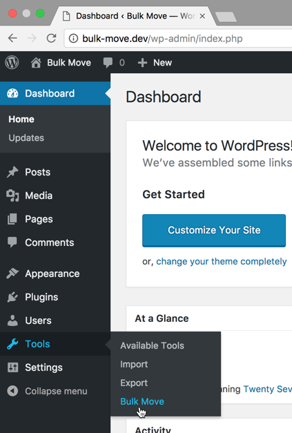
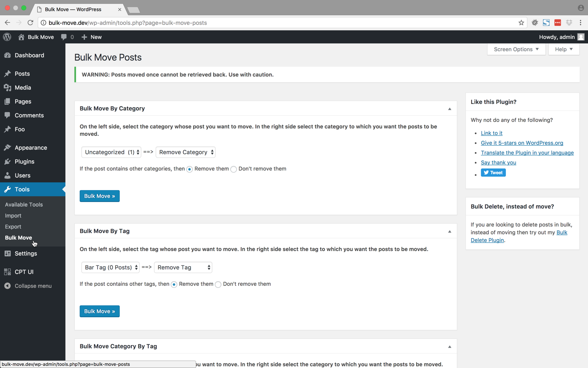
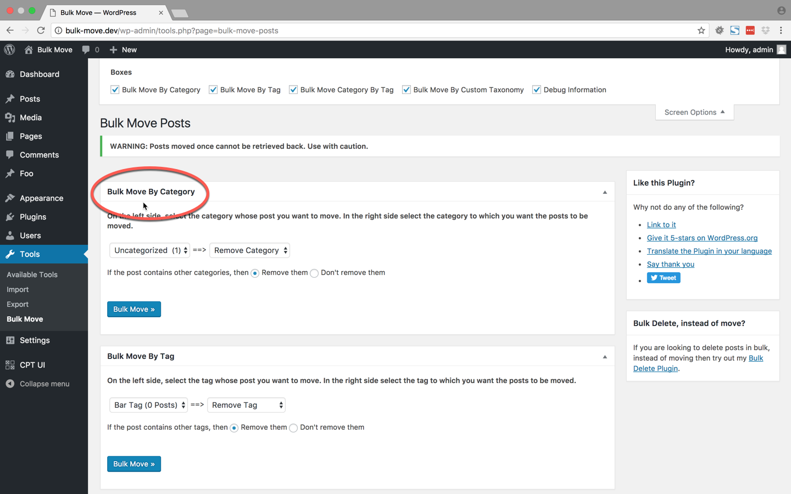
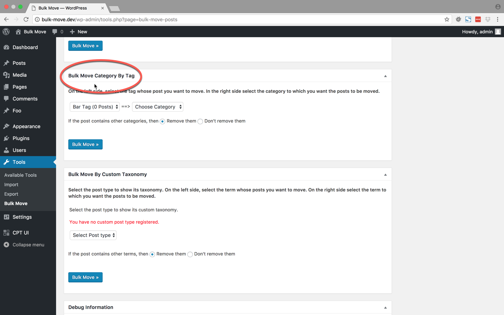

# Bulk Move #
**Contributors:** sudar  
**Tags:** bulk, mass, move, post, category
**Requires PHP:** 5.2  
**Requires at least:** 3.8  
**Tested up to:** 4.9  
**Stable tag:** 1.2.1  
    

Move or remove posts in bulk from one category, tag or custom taxonomy to another.

## Description ##

Bulk Move Plugin allows you to move posts in bulk from one category, tag or custom taxonomy to another.
This Plugin also allows you to disassociate posts from a certain category, tag or custom taxonomy.

If you looking for deleting posts or users in Bulk, instead of just moving them, then use [Bulk Delete Plugin][2] instead.

### Features

The following modules are available in the Bulk Move plugin.

#### Move posts from one category to another

This module allows you to move posts from one category to another or disassociate posts from a specific category.

#### Move posts from one tag to another

This module allows you to move posts from one tag to another or disassociate posts from a specific tag.

#### Move posts from category to tag

This module allows you to move posts from one category to another tag.

#### Move posts by custom taxonomy

This module allows you to move posts from one custom taxonomy to another. This module supports custom post types as well.

### Development

The development of the Plugin happens over at [github][4]. If you want to contribute to the Plugin, fork the [project at github][4] and send me a pull request.

If you are not familiar with either git or Github then refer to this [guide to see how fork and send pull request](http://sudarmuthu.com/blog/contributing-to-project-hosted-in-github).

If you are looking for ideas, then you can start with one of the following TODO items :)

### TODO

- Bulk Move pages to posts
- Bulk Move users from one role to another

### Support

- If you have found a bug/issue or have a feature request, then post them in [github issues][5]
- If you have a question about usage or need help to troubleshoot, then post in WordPress forums or leave a comment in [Plugins's home page][1]
- If you like the Plugin, then kindly leave a review/feedback at [WordPress repo page][6]. This will help more people to discover the plugin.
- If anything else, then contact me in [twitter][3].

 [1]: http://sudarmuthu.com/wordpress/bulk-move
 [2]: http://bulkwp.com
 [3]: http://twitter.com/sudarmuthu
 [4]: https://github.com/sudar/bulk-move
 [5]: https://github.com/sudar/bulk-move/issues
 [6]: https://wordpress.org/support/plugin/bulk-move/reviews/#new-post

## Translation ##

*   Brazilian Portuguese (Thanks Marcelo of Criacao de Sites em Ribeirao Preto)
*   Turkish Portuguese (Thanks Bahadir Yildiz)
*   Spanish (Thanks Brian Flores of InMotion Hosting)
*   Bulgarian (Thanks Nikolay Nikolov of Skype Fan Blog)
*   Hindi (Thanks Love Chandel)
*   Lithuanian (Thanks Vincent G)

## Installation ##

The simplest way to install the plugin is to use the built-in automatic plugin installer. Go to plugins -> Add New and then enter the name of the plugin to automatically install it.

If for some reason the above method doesn't work then you can download the plugin as a zip file, extract it and then use your favorite FTP client and then upload the contents of the zip file to the wp-content/plugins/ directory of your WordPress installation and then activate the Plugin from Plugins page.

## Frequently Asked Questions ##

### Instead of moving posts to another category, tag or taxonomy can I just disassociate the post from a category, tag or custom taxonomy? ###

Yes, it's possible to just disassociate the post from a category, tag or custom taxonomy. Just choose Remove Category/Tag/Term option in the right side dropdown.

### Can I move posts from a category to tag? ###

Yes. Use the 'Bulk Move Category by Tag' module to move posts from a category to a tag.

### Does Bulk Move supports custom taxonomies? ###

Yes. Use the 'Bulk Move Custom Taxonomies' module.

## Screenshots ##

This screenshot shows the Tools menu through which you can access the Bulk Move page.

This screenshot shows the Bulk Move Page. You can access the various Bulk Move modules here.

This screenshot shows the screen options where you can show or hide various Bulk Move Modules.

The 'Bulk Move by Category' module allows you to bulk move posts from one tag to another.

The 'Bulk Move by Tag' module allows you to bulk move posts from one tag to another.

The 'Bulk Move Category by Tag' module allows you to bulk move posts from one tag to another category.

The 'Bulk Move Custom Taxonomy' module allows you to bulk move posts from one custom taxonomy to another custom taxonomy.

In case you are facing issues and have to give us information about your server, then you can copy the information from the Debug Information module.

## Readme Generator ##

This Readme file was generated using <a href = 'http://sudarmuthu.com/wordpress/wp-readme'>wp-readme</a>, which generates readme files for WordPress Plugins.
